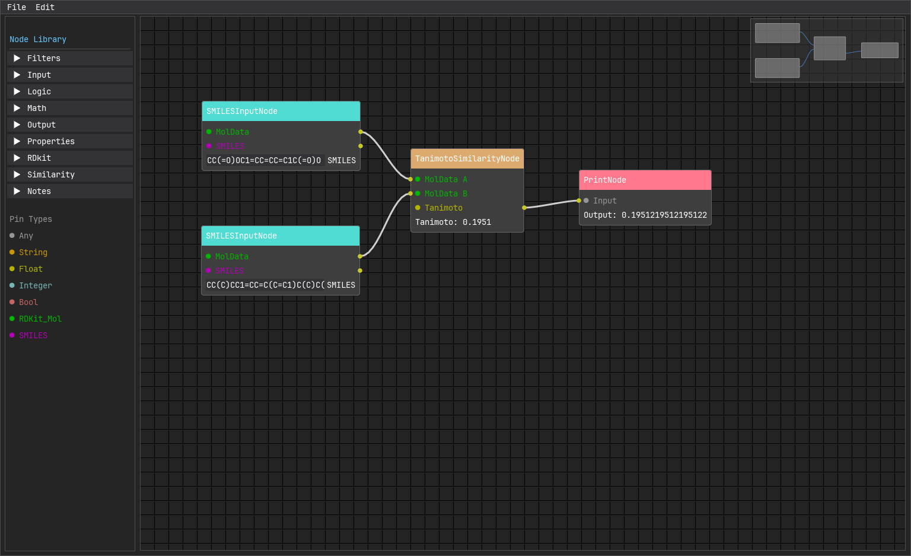

Все примеры расположены в [репозитории](https://github.com/groknut/catalyst/tree/main/examples).

### Проверка правила Липински (Rule of 5)
**Задача:** определить, проходит ли молекула по правилам лекарственного подобия, и сохранить изображение, если проходит.

**Узлы:** *SMILESInputNode* → *RuleOfFiveFilterNode* → *IfNode* → (`True`) *MolImageSaveNode*, (`False`) *PrintNode*

**Пошагово:**
1. Добавьте *SMILESInputNode*, введите `CC(=O)OC1=CC=CC=C1C(=O)O` (аспирин).
2. Добавьте *RuleOfFiveFilterNode* и соедините выход `MolData` с его входом.
3. Добавьте *IfNode*. Соедините `Pass` фильтра с входом `Pass` шлюза, а `MolOut` фильтра — с входом `MolData` шлюза.
4. К выходу `True` шлюза подключите *MolImageSaveNode* (имя файла `passed.png`).
5. К выходу `False` шлюза подключите *PrintNode*.

**Результат:** для аспирина изображение сохранится в `output/passed.png`. Если ввести заведомо неподходящую молекулу (например, таксол), *PrintNode* покажет «Closed».

### Сравнение двух молекул по Танимото

**Задача:** оценить структурное сходство аспирина и ибупрофена.

**Узлы:** два *SMILESInputNode* → *TanimotoSimilarityNode* → *PrintNode*

**Пошагово:**
1. Добавьте два *SMILESInputNode*. В первый введите `CC(=O)OC1=CC=CC=C1C(=O)O` (аспирин), во второй — `CC(C)CC1=CC=C(C=C1)C(C)C(=O)O` (ибупрофен).
2. Добавьте *TanimotoSimilarityNode*. Подключите выходы `MolData` обоих источников к входам `MolData A` и `MolData B`.
3. К выходу *Tanimoto* подключите *PrintNode*.

**Результат:** *PrintNode* покажет `Tanimoto: 0.19`. Молекулы умеренно схожи.

