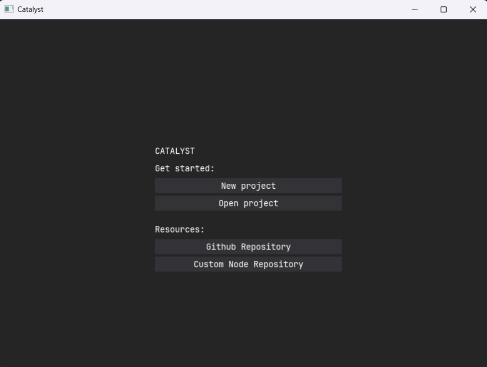
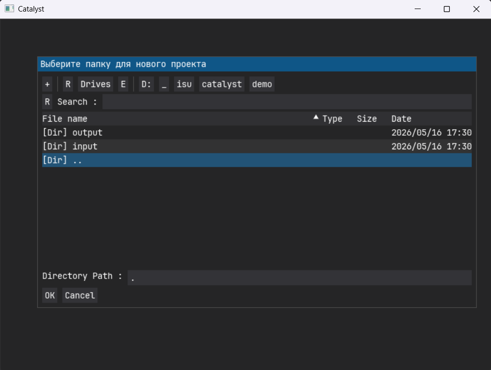
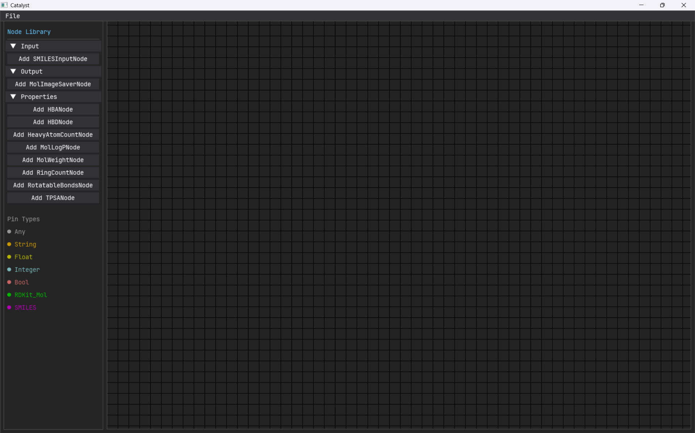
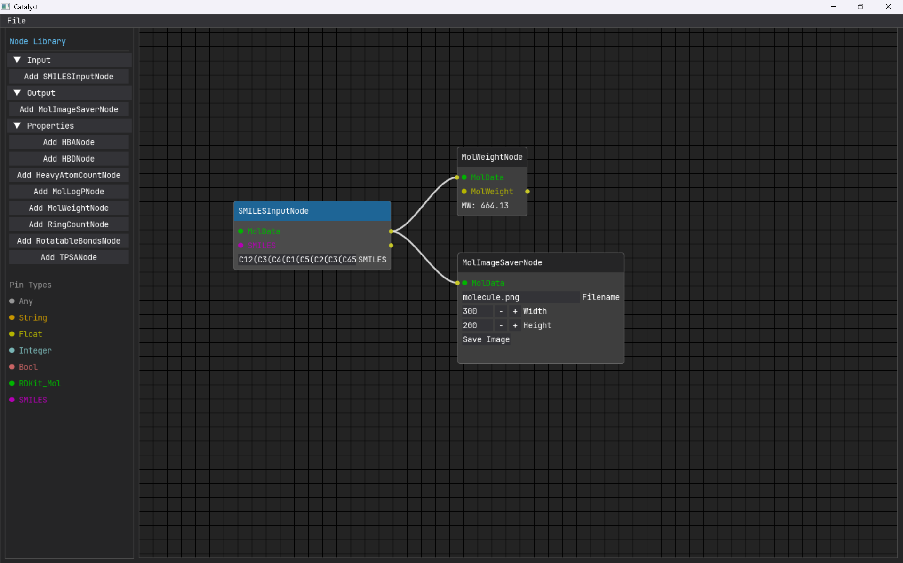

## Установка

### Из исходников
1. Склонируйте репозиторий:
```bash
   git clone https://github.com/groknut/catalyst.git
   cd catalyst
```

2. Установите зависимости с помощью `uv`:
```bash
uv sync
```
3. Запустите приложение:
```bash
uv run src/app.py
```

### Готовые сборки
~Сейчас находятся в активной разработке~

## Конфигурация
YAML‑конфиг автоматически создаётся в `~/.catalyst/config.yaml`:
```yaml
custom_nodes_dir: ~\.catalyst\custom_nodes
log_file: ~\.catalyst\catalyst.log
log_level: INFO
```

Для указания своего конфига используйте флаг `--config`:
```bash
uv run src/app.py --config my_config.yaml
```

## Первый проект
###  Запустите приложение и выберите создать новый проект:

###  Выберите директорию, в которой будет храниться данные вашего проекта:

###  После выбора директории проекта внутри создается следующая структура:
```plaintext
📁 проект/
├── 📁 input/            # Исходные данные (SDF, SMILES, CSV…)
├── 📁 output/           # Результаты (PNG, CSV, SDF, отчёты)
├── 📄 README.md         # Описание проекта (по желанию)
└── 📄 project.catalyst  # Граф узлов и связей (JSON)
```
И открывается редактор:


### Теперь мы можем начать строить химический пайплайн. Для начала мы выведем молекулярный вес и сохраним изображение октанитрокубана.

Его каноническая запись SMILES выглядит следующим образом:
```txt
C12(C3(C4(C1(C5(C2(C3(C45[N+](=O)[O-])[N+](=O)[O-])[N+](=O)[O-])[N+](=O)[O-])[N+](=O)[O-])[N+](=O)[O-])[N+](=O)[O-])[N+](=O)[O-]
```

Выбираем узлы:

- *SMILESInputNode* - позволяет вводить SMILES запись и переводить ее в `Mol` объект (для `rdkit`)
- *MolWeight* - вычисляет молекулярный вес молекулы и переводит его в `FLOAT`
- *MolImageSaveNode* - позволяет сохранить изображение молекулы

Получается следующий результат:

