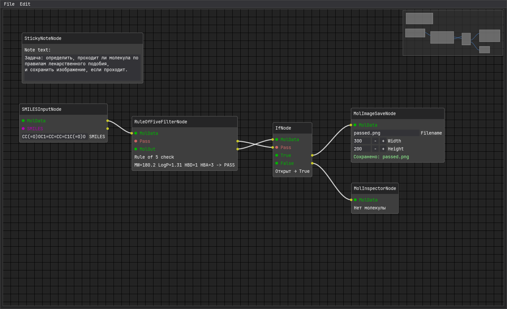

# Проверка правила Липински (Rule of 5)

**Задача:** определить, проходит ли молекула по правилам лекарственного подобия, и сохранить изображение, если проходит.

**Узлы:** `SMILESInputNode` → `RuleOfFiveFilterNode` → `IfNode` → (`True`) `MolImageSaveNode`, (`False`) `PrintNode`

**Пошагово:**
1. Добавьте `SMILESInputNode`, введите `CC(=O)OC1=CC=CC=C1C(=O)O` (аспирин).
2. Добавьте `RuleOfFiveFilterNode` и соедините выход `MolData` с его входом.
3. Добавьте `IfNode`. Соедините `Pass` фильтра с входом `Pass` шлюза, а `MolOut` фильтра — с входом `MolData` шлюза.
4. К выходу `True` шлюза подключите `MolImageSaveNode` (имя файла `passed.png`).
5. К выходу `False` шлюза подключите `PrintNode`.

**Результат:** для аспирина изображение сохранится в `output/passed.png`. Если ввести заведомо неподходящую молекулу (например, таксол), `PrintNode` покажет «Closed».

